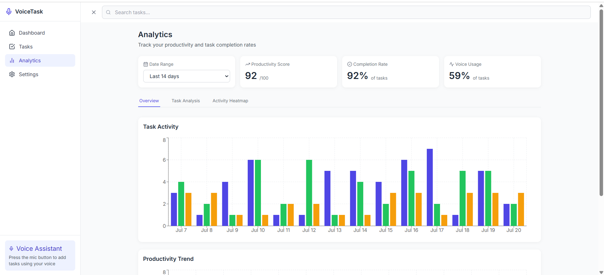

# VoiceTask – Task Manager with Voice Input

VoiceTask is a simple and intuitive task management web app to help you organize your daily activities. It allows you to create, track, and manage tasks easily with a clean interface. You can also add tasks using voice input for quick capture.

---

## ✨ Highlights

* 🗓 **Organized Dashboard**: View today’s tasks, progress, and upcoming deadlines.
* 🎙 **Voice Input**: Quickly add tasks without typing.
* 📊 **Analytics**: Track your productivity and completed tasks.
* 📱 **Responsive Design**: Works seamlessly on desktop and mobile.

*⚠️ AI-based task suggestions are in progress and coming soon.*

---

## 🔥 Features

* **Task Management**: Add, edit, delete, and categorize tasks.
* **Focus Mode**: Distraction-free view to focus on a single task.
* **Priority Tags**: Mark tasks as High, Medium, or Low priority.
* **Progress Tracking**: Visual indicators for completed and pending tasks.

---

## 📸 Screenshots


| Dashboard                          | Add Task Page                    |
| ---------------------------------- | -------------------------------- |
|  |  |

| Analytics Page                     | Settings Page                    |
| ---------------------------------- | -------------------------------- |
|  |  |

| Focus Mode                           |
| ------------------------------------ |
|  |

---

## ⚙ Tech Stack

* **React** (TypeScript)
* **Vite**
* **Tailwind CSS**
* **Supabase** (Auth & Database)
* **Web Speech API** (Voice Recognition)
* **Chart.js** (Analytics)

---

## 🚀 Getting Started

1. **Clone the repository**

```bash
git clone https://github.com/Nandini-Sutrave/VoiceTask.git
cd project
```

2. **Install dependencies**

```bash
npm install
```

3. **Run the app**

```bash
npm run dev
```

4. Visit [http://localhost:5173](http://localhost:5173)

---

## 🚧 Current Status

✅ Core features are **working**.
⚠️ **AI suggestions** are under development.

---


This is a clean and beginner-friendly task manager with voice input to make adding tasks faster.

